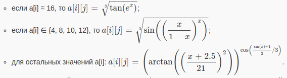

   <h3>Лабораторная работа №1</h3>

   
Написать программу на языке Java, выполняющую соответствующие варианту действия. Программа должна соответствовать следующим требованиям:

   <ol>
      <li>Она должна быть упакована в исполняемый jar-архив.</li>
      <li>Выражение должно вычисляться в соответствии с правилами вычисления математических выражений (должен соблюдаться порядок выполнения действий и т.д.).</li>
      <li>Программа должна использовать математические функции из стандартной библиотеки Java.</li>
      <li>Результат вычисления выражения должен быть выведен в стандартный поток вывода в заданном формате.</li>
   </ol>

   
Выполнение программы необходимо продемонстрировать на сервере <code>helios</code>.

 <ol>
   <li>Создать одномерный массив d типа long. Заполнить его чётными числами от 2 до 16 включительно в порядке убывания.</li>
   <li>Создать одномерный массив x типа float. Заполнить его 10-ю случайными числами в диапазоне от -8.0 до 13.0.</li>
   <li>Создать двумерный массив d размером 8x10. Вычислить его элементы по следующей формуле (где x = x[j]):
      
     

   <li>Напечатать полученный в результате массив в формате с пятью знаками после запятой.</li>
</ol>
